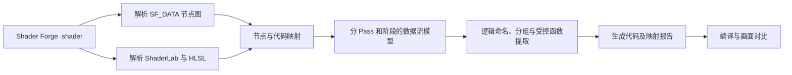

# Shader Forge Convert：项目需求与实施方案

版本：v0.3 草案，2026-09-20。本版目标是**把 Shader Forge 节点逻辑转成结构清楚的程序 Shader，并保留原效果**。技术依据及限制见[可行性调研](./可行性调研.md)和[上游架构调研](./Shader%20Forge%20与%20Shader%20Graph%20架构调研.md)。已有 `Partial` 转换探针，完整转换尚未实现。

本次已盘点上游的 [123 个菜单节点、127 个节点源码文件及非节点组件](./Shader%20Forge%20组件清单.md)，并生成 [512 项非 `.meta` 文件清单](./Shader%20Forge%20文件清单.tsv)。清单用于定位研究对象，兼容状态仍须逐节点验证。

## 1. 产品目标与输出标准

用户在 Unity 中选中 Shader Forge `.shader`，插件分析节点图和已有生成代码，导出一份能继续用 HLSL/ShaderLab 手写维护的 Shader。原始 Shader Forge 文件保留，作为效果基线与可继续编辑的节点图。

一份合格的转换结果应满足：

1. **效果保留：** 在声明支持的 Unity 版本/渲染管线/测试场景中，属性、纹理、渲染状态、Pass 和画面与原实现一致或差异经用户明确接受。
2. **逻辑可读：** Shader 的主要效果链被整理为带用途的变量或函数，可顺着“输入 → 运算 → 输出”读懂，不再靠 `node_123` 和大片混杂代码猜含义。
3. **可追溯：** 输出旁的报告说明每个逻辑块对应的节点 ID/端口、源 Pass 和源代码位置；未转换的部分明确标记。
4. **可维护：** 转换后不要求安装 Shader Forge 编辑器来编译；用户可以在导出副本中改代码。再次编辑原节点图后需重新转换，不能双向同步。

“干净”并非删掉所有 Unity 宏或把所有 Pass 压成一个 Pass。结构应服务于理解逻辑，同时保留渲染行为。

### 输出代码的目标形态

下面是结构示意，不是某个真实 Shader 的已验证转换：

```hlsl
// Material inputs: _MainTex, _Tint, _Mask, _ScrollSpeed

float2 AnimateUV(float2 uv, float timeY, float2 speed)
{
    return uv + timeY * speed;
}

float4 ComputeSurfaceColor(float2 uv)
{
    float2 animatedUV = AnimateUV(uv, _Time.y, _ScrollSpeed.xy);
    float4 albedo = tex2D(_MainTex, animatedUV) * _Tint;
    float mask = tex2D(_Mask, uv).r;
    return float4(albedo.rgb, albedo.a * mask);
}

// 原来的 Pass、渲染状态及必要宏仍按实际 Shader 保留。
```

这类函数提取只有在采样位置、UV、精度、宏作用域和调用次数保持符合原实现时才允许。不能为了外形好看改变顶点与片元之间的计算位置。

## 2. 支持范围与分层交付

| 级别 | 用户得到什么 | 是否算完成转换 |
| --- | --- | --- |
| `Full` | 目标效果链已变成命名、分组的程序逻辑；运行契约已验证；无关键 `node_编号` 遗留 | 是，限已声明支持的 Shader 类型 |
| `Partial` | 有部分逻辑重构，其他区域保留生成代码并定位原因 | 否；可导出供人工续写，但报告不得称完成 |
| `Unsupported` | 图/代码无法可靠映射，或验证失败 | 否；不输出可被误认为等价的结果 |

### v0.1：最小可用转换范围

目标为 Unity 2022.3 LTS、Built-in Render Pipeline 中的 **Unlit 与简单特效 Shader**。节点范围从真实样本确定，首批候选：属性、常量、四则运算、Lerp、UV/Time/Panner、纹理采样、遮罩/Clip、顶点偏移及最终颜色。要求至少把一条端到端效果链自动转成命名函数/变量，并追踪到最终输出；不是仅给原代码加注释。对范围内实际样本追求 `Full`。

### 后续范围

- v0.2：透明混合、多纹理效果、多个逻辑链共享、批量处理。
- v0.3：受控扩展至标准光照、阴影及多 Pass；光照生成代码与效果逻辑分离，保留原 Pass 契约。
- 更远期：自定义光照、曲面细分、GrabPass/折射、实例化、复杂关键词组合；逐类评估。URP/HDRP 迁移单独立项。

版本号与范围是计划，不是兼容承诺。具体支持清单应由真实测试样本产生。

## 3. 用户流程

1. 在 Project 面板选中 Shader Forge `.shader`，运行 `Tools/Shader Forge Convert/Convert to Code Shader`。
2. 插件显示图版本、节点数、输入属性、Shader 路径、Pass 列表、预计覆盖的效果链及不支持项。
3. 预览新旧逻辑：原节点链、拟生成的函数/变量、保留的生成代码和输出路径。
4. 导出到新的 `.shader`；源文件及 `.meta` 不变，新 Shader 使用唯一名称。
5. Unity 导入、编译并产生转换报告。用户把材质副本切换到新 Shader，查看固定场景对比。
6. 若状态为 `Partial`，用户可以继续手工修改导出代码；报告保留待处理清单。

原 `.mat` 引用不自动改动。自动迁移材质应作为单独功能设计，避免修改整个项目中的引用。

## 4. 结构化转换架构



### 4.1 模块职责

| 模块 | 输入/输出 | 关键要求 |
| --- | --- | --- |
| `ForgeGraphReader` | `SF_DATA` → 节点、端口、边、备注和最终输出 | 严格识别版本/分隔符；未知节点不能静默略过 |
| `ShaderSourceReader` | 源文本 → ShaderLab、Pass、预处理分支、函数、语句 | 词法处理注释/字符串；不以全局正则重写 HLSL |
| `GraphCodeMapper` | 图 + 源码 → 节点/表达式对应关系 | 给出映射证据与歧义；优先沿用生成器的 `node_ID` 和属性名 |
| `DataFlowBuilder` | 映射 → 阶段内依赖链 | 区分顶点、片元和不同 Pass；维持求值顺序、类型、精度与宏上下文 |
| `LogicRewriter` | 可确认依赖链 → 命名变量/函数 | 函数提取前检查输入、输出、作用域和副作用；每条规则可关闭 |
| `ShaderWriter` | 重构结果 + 原始契约 → 新 `.shader` | 保留必要 ShaderLab 状态、宏、Pass、Fallback 与依赖 |
| `VerificationReporter` | 原/新文件及测试 → `Full`/`Partial`/`Unsupported` | 列出已转节点、未转节点、代码映射、编译/画面结论 |

`SF_DATA` 描述意图，但无法代替原始生成代码中的光照和 Pass 实现；原代码是行为基线。节点图和源码对不上时，优先停止该区域的自动重构。[上游图解析](https://github.com/FreyaHolmer/ShaderForge/blob/master/Shader%20Forge/Assets/ShaderForge/Editor/Code/SF_Parser.cs#L47-L115)、[生成器](https://github.com/FreyaHolmer/ShaderForge/blob/master/Shader%20Forge/Assets/ShaderForge/Editor/Code/_Evaluator/SF_Evaluator.cs)

### 4.2 重构规则顺序

1. 从最终输出端口反向切片，找出真正参与该效果的节点链。
2. 用属性名称、节点备注与输出用途命名中间值；没有可靠语义名称则使用中性名称并在报告中标注。
3. 将相关表达式按 UV/纹理、形状/遮罩、顶点变形、颜色/发光等**由实际依赖决定的**步骤排序。
4. 只在同一 Pass、同一阶段和相同宏条件内做局部复用；跨阶段的同式计算分别保留。
5. 函数抽取后检查调用位置、类型、精度及可能的求值次数变化；校验失败就回滚该规则。
6. 对未识别节点或生成代码保留原实现，附 `Generated fallback` 注释和报告条目；不得删改为“看似更简洁”的近似实现。

不默认删除 `#pragma`、Pass、Shader 关键词、`GrabPass`、实例化宏或 `Fallback`。Shader Forge 专用 `CustomEditor` 和 ShaderImporter 默认纹理要分别核对，否则导出文件可能仍有插件依赖或材质显示差异。[上游保存与默认纹理设置](https://github.com/FreyaHolmer/ShaderForge/blob/master/Shader%20Forge/Assets/ShaderForge/Editor/Code/_Evaluator/SF_Evaluator.cs#L3315-L3390)

### 4.3 建议工程布局

```text
Packages/com.shaderforgeconvert/
  package.json
  Editor/
    ShaderForgeConvert.Editor.asmdef
    Graph/
    Source/
    Mapping/
    Rewrite/
    Export/
    UI/
  Tests/Editor/
    ShaderForgeConvert.Editor.Tests.asmdef
  Documentation~/
```

采用 Unity Package Manager 本地包，Editor 代码不直接依赖 Shader Forge 程序集。需要真实 Shader Forge 输入文件，但可以在未安装 Shader Forge 的测试工程中编译导出的 Shader。[Unity 自定义包文档](https://docs.unity3d.com/2022.3/Documentation/Manual/CustomPackages.html)

## 5. 验收条件

### 转换质量

- 支持范围内的真实 Shader，从输入属性、节点操作到 Final 输出，能在生成代码中追踪到对应逻辑。至少一条非平凡效果链被组织成用途明确的命名计算。
- `Full` 结果中主要效果链不再留下无意义的 `node_编号` 串；报告有节点 ID → 输出代码的映射。`Partial` 列出具体未处理节点/Pass，不隐藏原代码。
- 输出保留原材质属性的名称和类型，以及必要的 ShaderLab 状态、Pass、宏、关键词和外部依赖。
- 原 Shader 文件、`.meta` 与材质引用保持不变；新文件命名不与原 Shader 冲突。

### 行为验证

- 在目标 Unity 版本中，原/新 Shader 均无新增编译错误；记录警告和平台。可通过 Unity 的 `ShaderUtil.GetShaderMessages` 收集编译消息，但还需真实目标平台测试。[Unity ShaderUtil 文档](https://docs.unity3d.com/ScriptReference/ShaderUtil.GetShaderMessages.html)
- 使用同一材质参数、纹理、网格、相机、光照、时间和 Graphics API 做截图对照。阈值和容差随样本及效果类型设定，并记录差异图。动态效果需固定时间输入或采集同一帧。
- 对 Alpha Clip、Blend、ZWrite、阴影等，除主画面外检查对应 Pass 与渲染状态。编译通过或截图相近都不能单独证明跨平台等价。
- 任何无法证明的自动改写规则可独立关闭；失败时不输出 `Full`。

### 必备测试样本

简单 Unlit、UV 动画+纹理/遮罩、透明或 Clip、顶点偏移、标准光照、多 Pass/阴影各至少一份；另加无 `SF_DATA`、损坏图数据和未知节点的负例。v0.1 只对前几类中实际通过验证的组合宣称 `Full`，其余可为 `Partial` 或 `Unsupported`。

## 6. 开发阶段与投入估算

| 阶段 | 交付与继续条件 | 粗估（1 名熟悉 Unity Shader/Editor 的开发者） |
| --- | --- | --- |
| P0：样本和技术探针 | 收集真实文件，解析图并把节点映射到生成代码；完成 1 条效果链的可验证转换 | 1–2 周 |
| P1：Unlit 逻辑转换 | 图/源码中间表示、命名、分组、函数提取、预览和报告；受支持样本达到 `Full` | 2–4 周 |
| P2：Unity 验证与交付 | Editor 包、编译/画面对比、失败回滚、文档和兼容清单 | 1–2 周 |
| P3：光照与多 Pass | 按样本逐类扩展，另行估算 | 待 P0/P1 结果确定 |

上述是探索性估算，**不是承诺工期**。最大的未知是不同 Shader Forge 版本、节点及生成器路径之间能否建立可靠的“图节点 → 代码片段”映射。如果 P0 失败，应将产品定位调整为“半自动逻辑重构助手”，让开发者确认映射后生成代码。

### 当前进度（2026-09-20）

| 项目 | 状态 | 证据 |
| --- | --- | --- |
| 上游文档、源码模块与文件盘点 | 已完成静态清单 | 架构调研、组件清单、文件清单 |
| 节点图读取与 Final 依赖追踪 | 已实现探针 | 20 份上游 `.shader` 可读取并调用转换器 |
| 图备注/纹理属性到代码变量命名 | 已实现受限规则 | `VertexAnimation` 有 3 个图备注变量被命名；粒子加色预设的纹理采样变量被命名 |
| 单一 Emission 逻辑抽取 | 已实现严格模式 | `PresetUnlit` 和 `PresetParticleAdditive` 生成 `ComputeEmission` |
| Unity Editor 编译/导入 | 已验证 2022.3.62f3 的 3 份样本 | 独立临时工程，导出 Shader 均无 `ShaderUtil.ShaderHasError` |
| 画面/材质/平台等价 | 未验证 | 不输出 `Full` |
| 通用逻辑链及全部节点 | 未实现 | 未建立逐节点兼容矩阵 |

## 7. 当前需要的开发输入

继续推进 P0 需要 **3–6 个用户实际使用的 Shader Forge `.shader`**，最好包含对应 `.mat`、纹理及一份能看到效果的场景。当前已有 Unity 包和独立核心测试：上游两份示例的导出 Shader 在 Unity 2022.3.62f3 中导入成功且无编译错误；仍缺用户真实样本、材质/画面对照和完整逻辑链重构。
