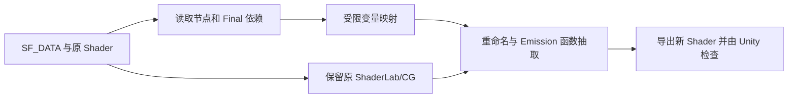

# 设计与开发状态

我希望把 Shader Forge 的节点计算整理成可以继续手写维护的 Shader，同时保留原文件的实际渲染行为。输入是带有 `SF_DATA` 的 `.shader`，输出是新的 Shader 资源；原图仍可在 Shader Forge 中编辑，导出结果不与原图双向同步。

当前包版本为 **`0.1.0-preview.2`**。它已能运行，但所有结果仍是 `Partial`。组件盘点见[节点与组件清单](./Shader%20Forge%20组件清单.md)和[512 项文件清单](./Shader%20Forge%20文件清单.tsv)；盘点不等于逐节点兼容。

## 输出标准

- **效果：** 原 Shader 的属性、纹理、Pass、渲染状态、关键词和画面在声明的测试条件下保持一致。
- **代码：** 主要效果链按输入、运算与输出组织，能够从节点或属性追溯到命名变量和函数。
- **维护：** 输出不依赖 Shader Forge 编辑器编译，原 `.shader`、`.meta` 和材质引用不变。
- **报告：** 记录已重构的节点/代码位置与未处理区域。未通过完整验证的结果不标为 `Full`。

`Full` 要求效果链重构及运行验证均完成；`Partial` 保留未映射的生成代码；图损坏、没有连接的 Final 输入或不能可靠解析时为 `Unsupported`。当前界面只导出 `Partial`，尚未实现完整转换报告与 `Full` 判断。

## 当前操作

在 Unity Project 面板选中 Shader Forge `.shader`，运行 **Tools > Shader Forge Convert > Convert Selected Shader**。工具让编辑者选择一个新的 `.shader` 路径，给 Shader 名称添加 `/Code`，导入文件并检查 Shader 错误。重名、覆盖原文件或导入失败会中止导出。材质引用不会自动切换。

目前的转换规则包括：

1. 读取图节点与连线，沿 Final 输入追踪有效依赖。
2. 只在 CG/HLSL 代码区替换能与节点备注或纹理属性对应的变量名；跳过注释、字符串和预处理指令。
3. 对结构符合规则的单一 Emission 片元代码提取 `ComputeEmission`。
4. 保留原 ShaderLab、Pass、宏和未覆盖的生成代码，移除图数据与专用 Inspector 引用。

完整代码解析、中间表示、通用节点表达式映射、预览和逐项转换报告尚未实现。[可行性分析](./可行性调研.md)解释了为什么不能把原代码直接按节点图全文重写。

## 代码路径

当前实现位于 `Packages/com.shaderforgeconvert/Editor/Core`：`ForgeGraphReader` 负责图读取，`ShaderConverter` 负责源码改写，Editor 菜单负责另存与导入检查。独立的 `.NET` 冒烟测试在 `tools/SmokeTests`；Unity 样本探针在 `tools/UnityBatchProbe`。架构与上游组件的关系见[架构调研](./Shader%20Forge%20与%20Shader%20Graph%20架构调研.md)。

## 验证与后续范围

Unity 2022.3.62f3 已能从公开 Git 包安装。10 个上游预设、10 个示例完成原/导出 Shader 导入检查，材质公开契约差异为 0；`VertexAnimation` 在 Metal 上两组参数逐像素一致。详细条件见[验证记录](./验证记录.md)。

下一阶段是为基础算术、UV、纹理与遮罩建立“节点端口 → 源码表达式”的可靠映射，抽出一条从输入到 Final 的完整效果链。之后逐类扩展透明、顶点动画、光照与多 Pass。每种规则需分别验证类型、作用域、宏条件和画面；URP/HDRP 迁移单独处理。当前 123 个菜单节点中，尚无逐节点完成的兼容矩阵。
